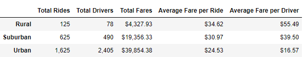
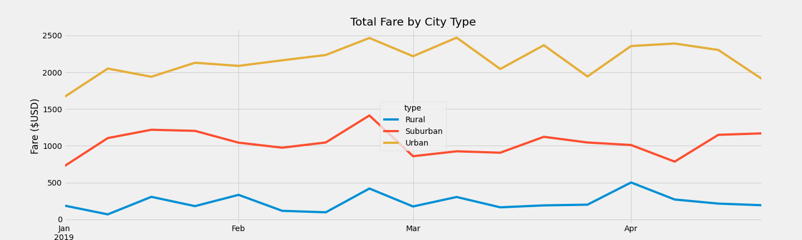

# PyBer_Analysis
Analysis of Q1 PyBer ride-share data

## Overview of the analysis

### Purpose
To create visualizations of rideshare data for PyBer to help improve access to ride-sharing services and determine affordability for underserved neighborhoods.

## Results 

### Analysis of Pyber Data 

Rural Pyber users on average should expect to pay more for rides. Cities by nature have higher populations, leading to a bigger driver pool and allowing Pyber users to get lower fares. 

The more urban areas were by far the biggest generators of fares for Pyber.

## Summary 

### Recommendations 
I would advise Pyber to create some type of incentive program to try to get more drivers out to rural and suburban areas with unmet demand. 

